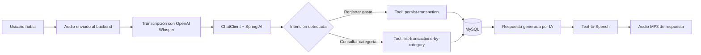
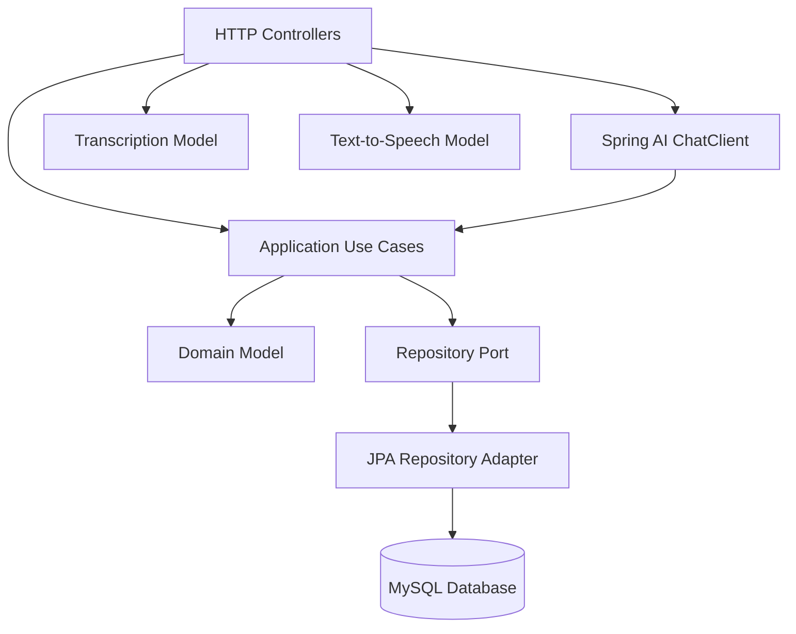
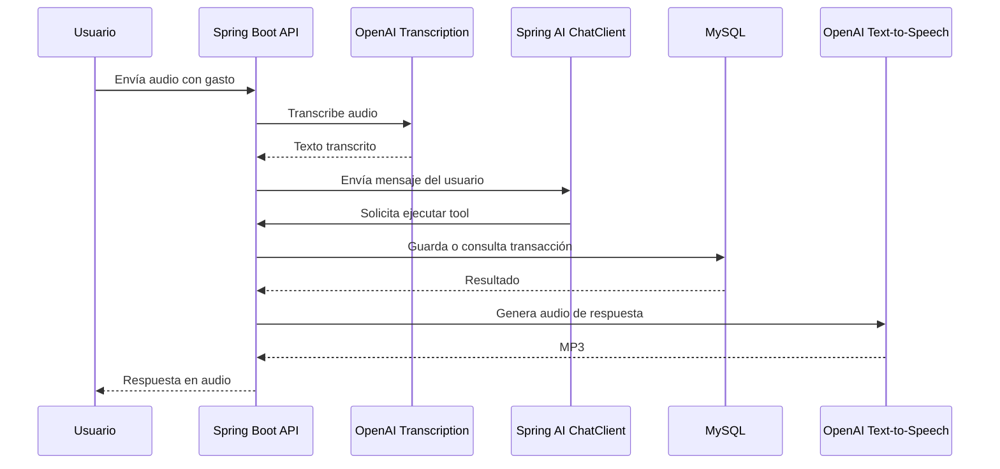

# Smart Budgeting Assistant 🎙️💸

Aplicación backend inteligente para registrar, consultar y automatizar gastos personales mediante voz, lenguaje natural e inteligencia artificial.

El proyecto transforma una instrucción hablada como:

> “Gastei 50 reais no Starbucks agora”

En una transacción financiera estructurada, categorizada y persistida automáticamente en base de datos.

---

## 🚀 Propósito del proyecto

Las aplicaciones tradicionales de control financiero suelen depender de formularios manuales: el usuario debe abrir la app, escribir la descripción, ingresar el valor, seleccionar una categoría y guardar la transacción.

**Smart Budgeting Assistant** reduce esa fricción usando IA conversacional y comandos de voz.  
El usuario simplemente habla, el sistema interpreta la intención, extrae los datos relevantes, categoriza el gasto y registra la transacción.

Este enfoque lleva el registro financiero personal a una experiencia más natural, rápida y automatizada.

---

## ✨ Funcionalidades principales

- Registro de gastos mediante API REST.
- Consulta de transacciones por categoría.
- Registro inteligente de transacciones usando lenguaje natural.
- Entrada por voz mediante archivo de audio.
- Transcripción automática del audio.
- Interpretación del mensaje con OpenAI y Spring AI.
- Ejecución de herramientas internas para persistir o consultar datos.
- Respuesta generada en audio.
- Persistencia en MySQL con Spring Data JPA.
- Entorno local reproducible con Docker Compose.

---

## 🧠 ¿Cómo funciona?

El sistema recibe un audio del usuario, lo transcribe, interpreta el contenido financiero, ejecuta una acción sobre la base de datos y responde con audio.



---

## 🏗️ Arquitectura

El proyecto está organizado por capas para separar responsabilidades y facilitar mantenimiento, pruebas y evolución.



---

## 🧩 Módulos principales

### Dominio

Contiene las reglas y entidades centrales del negocio:

- `Transaction`
- `TransactionId`
- `Category`
- `TransactionRepository`

Las transacciones incluyen descripción, monto, categoría e identificador único.

### Aplicación

Contiene los casos de uso principales:

- `PersistTransactionUseCase`
- `ListTransactionsByCategoryUseCase`

Estos casos de uso también están expuestos como herramientas para Spring AI, permitiendo que el modelo ejecute acciones reales dentro del sistema.

### Infraestructura HTTP

Expone los endpoints REST para interactuar con la aplicación:

- Crear transacciones.
- Consultar transacciones por categoría.
- Procesar audios con IA.

### Persistencia

Implementa el acceso a datos usando:

- Spring Data JPA
- MySQL
- Repositorios adaptadores
- Entidades JPA

---

## 🛠️ Stack técnico

- Java 25
- Spring Boot 4
- Spring AI
- OpenAI API
- OpenAI Whisper
- OpenAI Text-to-Speech
- Spring Web
- Spring Data JPA
- MySQL
- Docker Compose
- Gradle
- Lombok

---

## 📌 Endpoints principales

### Crear una transacción manualmente

```http
POST /transactions
Content-Type: application/json
```

Body:

```json
{
  "description": "Compra en supermercado",
  "category": "GROCERIES",
  "amount": 50000
}
```

Respuesta esperada:

```json
{
  "id": "uuid",
  "category": "GROCERIES",
  "description": "Compra en supermercado",
  "amount": 50000.0
}
```

---

### Consultar transacciones por categoría

```http
GET /transactions/{category}
```

Ejemplo:

```http
GET /transactions/RESTAURANT
```

Categorías disponibles:

```txt
GROCERIES
RESTAURANT
PHARMA
HEALTH
AUTO
TRANSPORT
HOUSING
UTILITIES
EDUCATION
ENTERTAINMENT
SHOPPING
TRAVEL
SERVICES
INCOME
INVESTMENT
OTHER
```

---

### Procesar audio con IA

```http
POST /transactions/ai
Content-Type: multipart/form-data
```

Form-data:

| Key | Type | Value |
|---|---|---|
| file | File | audio.mp3 / audio.m4a |

Flujo interno:

1. Recibe el archivo de audio.
2. Transcribe el contenido.
3. Envía el texto al asistente financiero.
4. El asistente decide si debe registrar o consultar transacciones.
5. Ejecuta la herramienta correspondiente.
6. Genera una respuesta en audio MP3.

---

## 🧠 Ejemplo de uso con voz

Entrada del usuario:

```txt
Gastei 50 reais no Starbucks agora
```

El sistema interpreta:

```json
{
  "description": "Starbucks",
  "amount": 50.00,
  "category": "RESTAURANT"
}
```

Respuesta esperada:

```txt
Gasto registrado: 50 reais en Starbucks, categoría restaurante.
```

---

## 🗄️ Base de datos

El proyecto utiliza MySQL ejecutándose en Docker.

Archivo `compose.yml`:

```yaml
services:
  database:
    image: mysql:9.6
    environment:
      MYSQL_DATABASE: transaction
      MYSQL_USER: app
      MYSQL_ROOT_PASSWORD: root
      MYSQL_PASSWORD: app
    ports:
      - "3307:3306"
    volumes:
      - transaction_data:/var/lib/mysql

volumes:
  transaction_data:
```

Spring Boot Docker Compose permite detectar y gestionar el servicio de base de datos durante el desarrollo.

---

## ⚙️ Configuración

Antes de ejecutar la aplicación, define la variable de ambiente:

```bash
OPENAI_API_KEY=tu_api_key
```

En Windows PowerShell:

```powershell
$env:OPENAI_API_KEY="tu_api_key"
```

La aplicación usa esta variable para conectarse con los servicios de OpenAI.

---

## ▶️ Ejecución local

Clonar el repositorio:

```bash
git clone https://github.com/tu-usuario/tu-repositorio.git
cd tu-repositorio
```

Ejecutar la aplicación:

```bash
./gradlew bootRun
```

En Windows:

```powershell
.\gradlew bootRun
```

Docker Compose levantará la base de datos MySQL durante el desarrollo si la integración está activa.

---

## 🧪 Pruebas

Ejecutar tests:

```bash
./gradlew test
```

En Windows:

```powershell
.\gradlew test
```

---

## 📷 Concepto visual del sistema

El proyecto parte de una idea simple: convertir voz en datos financieros estructurados.



---

## 💡 Valor diferencial

Este proyecto no se limita a registrar gastos.  
Su objetivo es demostrar cómo la inteligencia artificial puede mejorar una tarea cotidiana reduciendo pasos manuales y transformando una experiencia rígida en una interacción conversacional.

La solución combina:

- Automatización de entrada de datos.
- Interpretación de lenguaje natural.
- Categorización financiera.
- Persistencia estructurada.
- Interacción por voz.
- Respuesta generada por IA.

Esto convierte el registro financiero en una experiencia más cercana, rápida y accesible.

---

## 📈 Posibles mejoras futuras

- Autenticación de usuarios.
- Dashboard web o móvil.
- Reportes mensuales de gastos.
- Detección de patrones de consumo.
- Presupuestos por categoría.
- Alertas de gasto excesivo.
- Soporte multi-moneda.
- Integración con WhatsApp o Telegram.
- Despliegue cloud en AWS.
- Migraciones con Flyway o Liquibase.

---

## 👨‍💻 Autor

**Sebastián López Montenegro**  
Estudiante de Ingeniería de Sistemas  
Backend & Cloud Developer

- LinkedIn: https://www.linkedin.com/in/sebastianlopezdev
- GitHub: https://github.com/Sxl07
